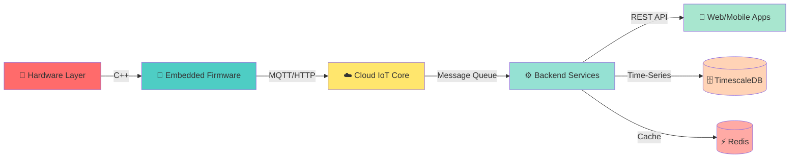

  
# 👋 Hi, I'm Avtma!

---

## 🚀 About Me

I'm a **passionate electronics and embedded systems specialist** with expertise spanning from low-level microcontroller programming to cloud-based IoT architectures. I build **scalable, real-time systems** that bridge hardware and software, transforming sensor data into actionable insights.

🔧 **What I Do:**
- Design and develop **embedded systems** using ESP32, STM32, and CH32 microcontrollers
- Build **full-stack IoT platforms** with real-time data processing and cloud integration
- Architect **scalable backend systems** with microservices and message queuing
- Create **responsive web and mobile applications** for IoT monitoring and control

---

## 💻 Tech Stack

### ⚡ Embedded Systems & Electronics

  
  
  
  
  

### 🖥️ Programming Languages

  
  
  
  

### 🌐 Backend & Frameworks

  
  
  
  

### 🗄️ Databases & Message Queues

  
  
  
  

### ☁️ Cloud & IoT Services

  
  
  
  

---

## 🏗️ Architecture Expertise

---

## 📊 GitHub Stats

  
  

  

---

## 🎯 What I'm Working On

- 🔭 Building **scalable IoT platforms** for industrial monitoring and automation
- 🌱 Exploring **edge computing** and **AI/ML on embedded devices**
- 💡 Developing **energy-efficient firmware** for battery-powered IoT devices
- 🚀 Creating **real-time data pipelines** with TimescaleDB and RabbitMQ

---

## 📫 Let's Connect!

  
  
  
  

---

  
### 💭 *"Building the future, one microcontroller at a time"*

